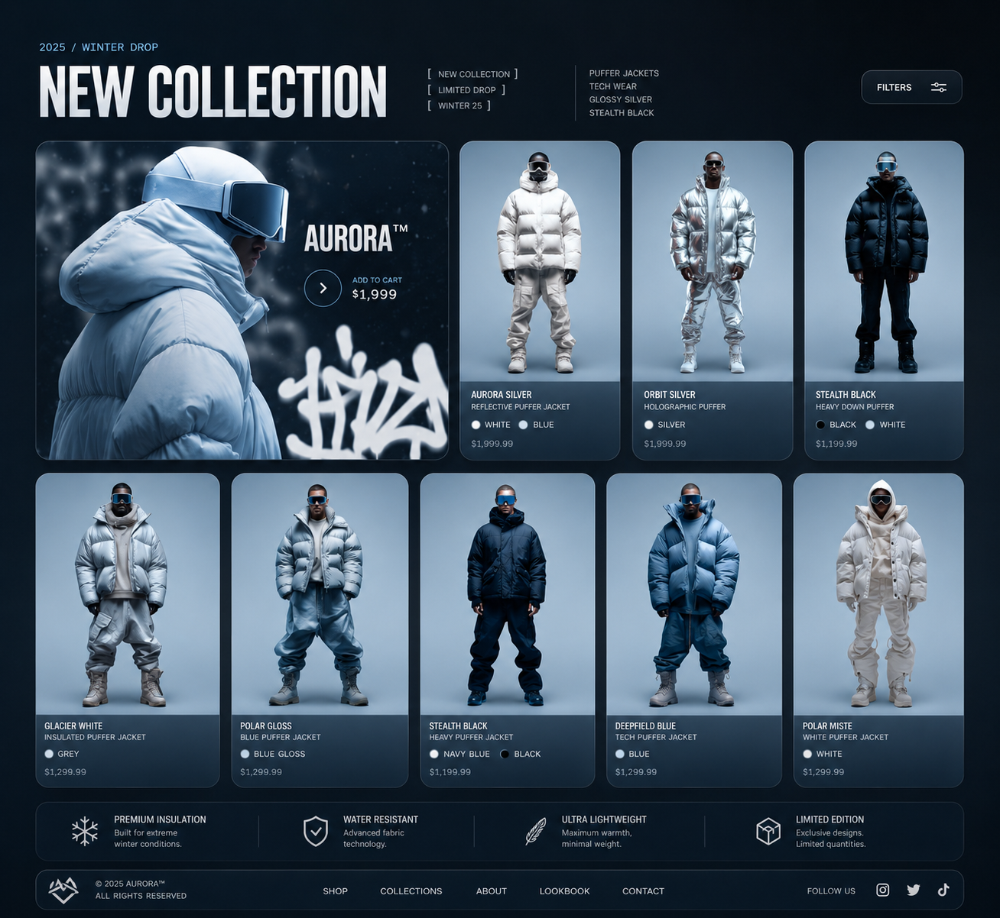

# Assignment 2: CSS Flexbox & Positioning - Medium

## Live Demo

[View Live Website](https://dancing-dieffenbachia-1ac5bc.netlify.app/)

Recreate **three UI designs** using CSS Flexbox and positioning properties.

## 🎯 Requirements

- Use `display: flex` for layout structure
- Use `position: relative` and `position: absolute`
- Match layouts as closely as possible
- Keep code organized and clean

## 📁 Project Structure

- `index.html` — Page structure
- `styles.css` — CSS styling
- `assets/` — Images and resources

## 🛠️ Getting Started

1. Choose three designs to recreate
2. Analyze layout structure
3. Create semantic HTML
4. Apply Flexbox and positioning

## 📚 Resources

Images: [Unsplash](https://unsplash.com/), [Pexels](https://www.pexels.com/), [Freepik](https://www.freepik.com/), Google Images

Research: ChatGPT, MDN, CSS-Tricks

## ✅ Success Criteria

- Three designs recreated
- Layouts match references
- Flexbox and positioning work correctly
- Code is clean and organized
