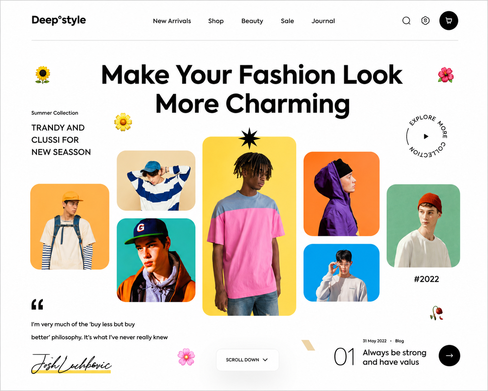

# Assignment 4: CSS Grid Layout - Hard

## Live Demo

[View Live Website](https://a4-hard.netlify.app/)

Recreate a **fashion landing page design** using CSS Grid, custom styling, and precise visual positioning.

## Requirements

- Use `display: grid` for the main layout structure
- Match the design as closely as possible
- Keep spacing, typography, and image placement clean and consistent
- Write organized HTML and CSS

## Project Structure

- `index.html` - Page structure
- `style.css` - CSS styling
- `Assets/` - Images, fonts, and resources

## Getting Started

1. Study the reference design carefully
2. Build the page structure with semantic HTML
3. Create the layout using CSS Grid
4. Refine styling, positioning, and responsiveness

## Resources

- Images and assets from the provided `Assets/` folder
- Research: ChatGPT, MDN, CSS-Tricks

## Before Asking Mentors

1. Try solving it yourself
2. Discuss with classmates
3. Research online
4. Then contact mentors if stuck

## Done When

- The landing page closely matches the reference
- Grid layout is used effectively
- Styling looks polished and consistent
- Code is clean and well-structured
