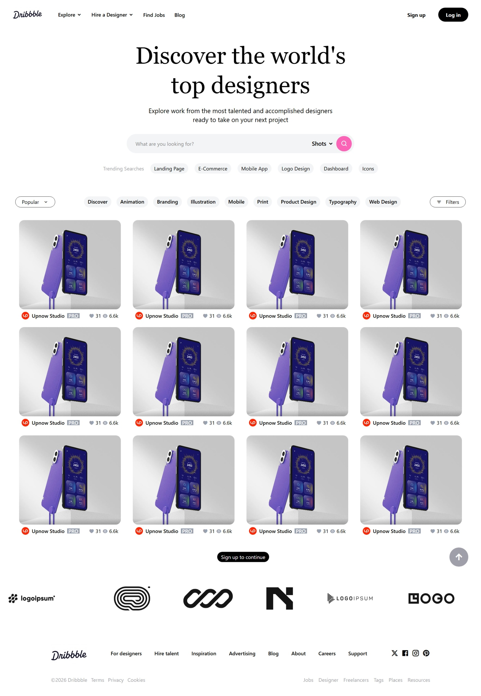

# Assignment 5 - Medium

This project is a frontend recreation of a Dribbble-style landing page built with HTML, CSS, and Tailwind utility classes.

Live Demo: https://a5-medium1.netlify.app/

## Preview



## Overview

The page includes a navigation bar, hero section, search bar, trending tags, category filters, a repeated design-card gallery, a scrolling brand logo strip, and a footer.

## Features

- Clean landing page inspired by Dribbble
- Search bar with category selector
- Trending search tags
- Filter and category chips
- Hover overlay on design cards
- Infinite marquee-style client logo section
- Footer with navigation and social icons

## Tech Stack

- HTML5
- CSS3
- Tailwind CSS via CDN
- Remix Icon

## Project Structure

```text
MEDIUM/
|-- index.html
|-- README.md
|-- style.css
|-- task-A5.jpeg
`-- Assets/
    `-- android-chrome-192x192.png
```

## Run Locally

1. Open the `Assignments/A5/MEDIUM` folder.
2. Launch `index.html` in your browser.

## Notes

- The layout uses Tailwind utility classes directly inside `index.html`.
- The marquee animation is defined in `style.css`.
- Several images are loaded from external URLs.
