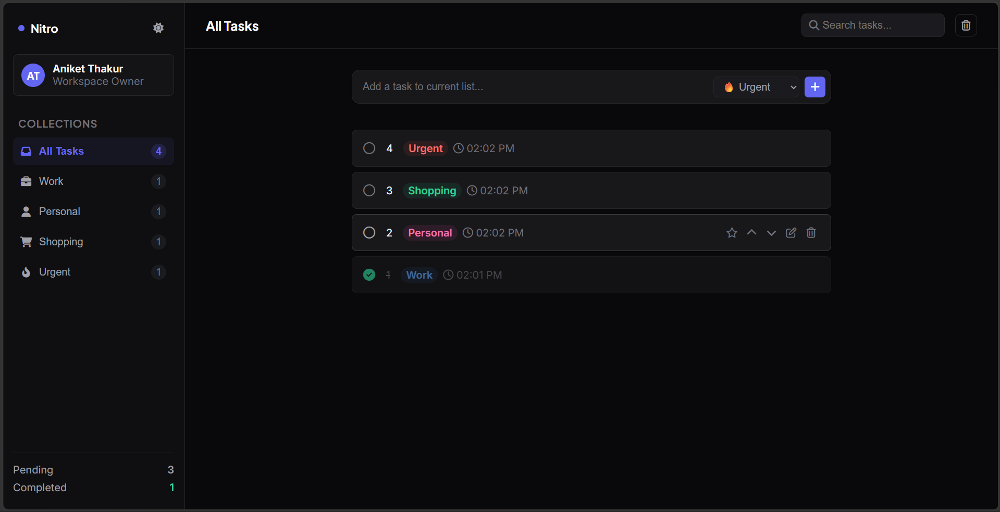

# Nitro Task

Nitro Task is a lightweight task management web app built with HTML, CSS, and vanilla JavaScript. It supports creating tasks, categorizing them, marking them complete, starring important items, reordering, searching, and saving everything in `localStorage`.

## Live Demo

https://nitro-task.netlify.app/

## Repository

https://github.com/AniketThakur6/cohort-3.0_Assignments/tree/main/A7

## Screenshot



## Features

- Add new tasks with a category
- Filter tasks by collection:
  - All Tasks
  - Work
  - Personal
  - Shopping
  - Urgent
- Search tasks by title
- Mark tasks as completed or pending
- Star important tasks
- Move tasks up or down
- Edit existing task titles
- Delete individual tasks or clear all tasks
- Dark and light theme toggle
- Persistent storage using `localStorage`

## Tech Stack

- HTML5
- CSS3
- Vanilla JavaScript
- Font Awesome icons
- Google Fonts

## Project Structure

```text
A7/
├── index.html
├── style.css
├── script.js
├── favicon.png
├── task-ui.png
└── README.md
```

## How to Run

1. Clone the repository.
2. Open the `A7` folder.
3. Open `index.html` in your browser.

If you want, you can also serve it with any local static server.

## Notes

- Tasks are stored locally in the browser, so they remain after refresh.
- The app uses a responsive two-panel layout with a task workspace and sidebar stats.

