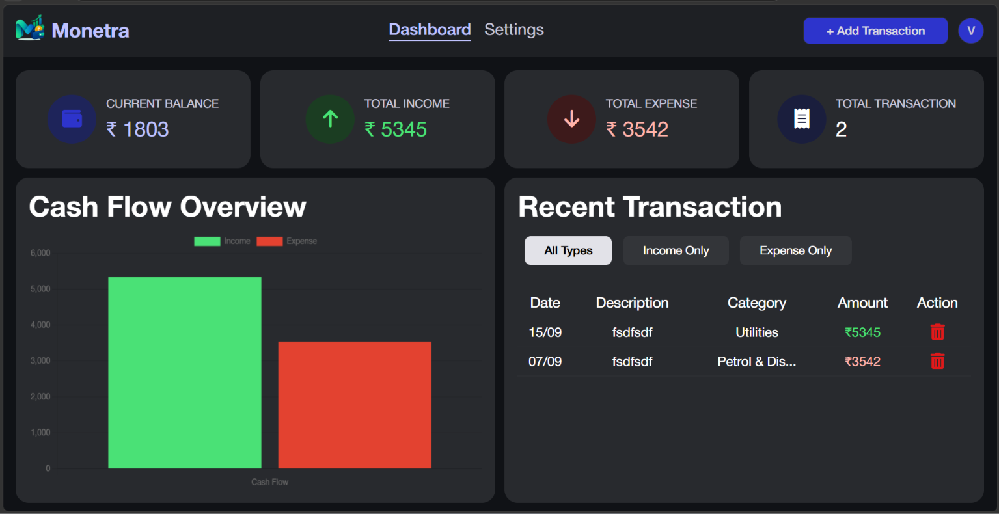
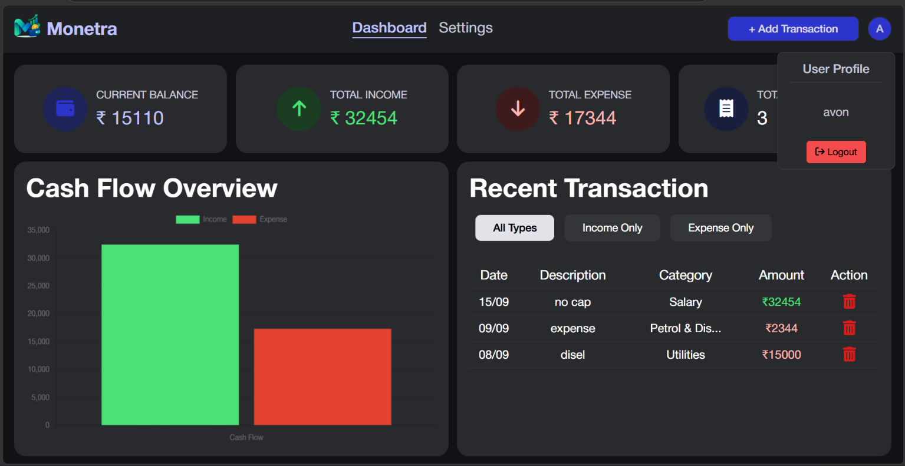

# Monetra

Monetra is a simple personal finance dashboard for tracking income, expenses, and overall cash flow in one place.

## Live Demo

[Open Monetra](https://monetra-a8.netlify.app/)

## Screenshots

### Dashboard



### Settings and account view



## Features

- User sign-up and login flow
- Password visibility toggle
- Dashboard with current balance, total income, total expenses, and transaction count
- Add income or expense transactions
- Transaction categories such as Salary, Food & Dining, Utilities, Entertainment, and Other
- Transaction date, description, amount, and category details
- Recent transaction table with income and expense styling
- Filter transactions by all types, income, or expenses
- Delete individual transactions
- Cash flow chart showing income and expenses
- Light and dark theme toggle
- Preferred currency selection for INR, USD, EUR, GBP, and AED
- Editable display name
- Reset all transaction and currency data
- User profile menu with logout option
- Data persistence using browser localStorage
- Responsive dashboard layout for different screen sizes

## Tech Stack

- HTML5
- CSS3
- JavaScript
- Chart.js
- Font Awesome
- Browser localStorage

## Run Locally

1. Clone or download this repository.
2. Open the `A8` folder.
3. Open `index.html` in a browser, or serve the folder with a local development server.
4. Create an account and log in to start adding transactions.

No backend or build process is required. User accounts, preferences, and transactions are stored locally in the browser.

## How To Use

1. Create an account from the sign-up screen.
2. Log in with the registered username and password.
3. Select **Add Transaction** to record income or an expense.
4. Review totals and the cash flow chart on the dashboard.
5. Use the transaction filters to view specific transaction types.
6. Open **Settings** to change the display name, currency, theme, or reset saved data.

## Project Structure

```text
A8/
├── index.html
├── script.js
├── style.css
├── Asset/
├── UI.png
└── UI2.png
```
