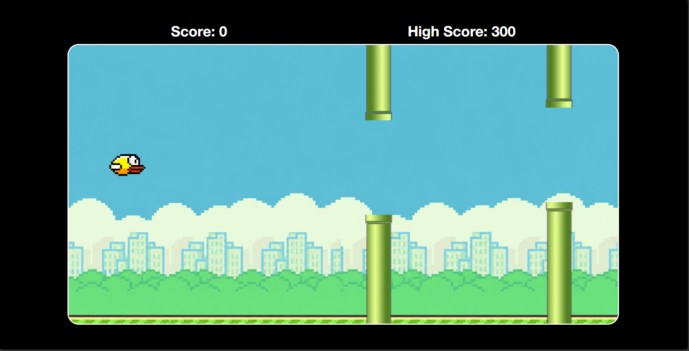

# Flappy Bird Game

This project is a browser-based Flappy Bird clone built with HTML, CSS, and JavaScript. The player controls a bird that must fly through gaps between moving pipes without crashing into them or leaving the game window.

## Live Demo

[Play the game here](https://flappy-bird-game01.netlify.app/)

## GitHub Repository

[View the source code on GitHub](https://github.com/AniketThakur6/cohort-3.0_Assignments/tree/main/Project/Flappy%20Bird)

## Gameplay

- Press `Space` to start the game.
- Press `Space` again while playing to make the bird jump.
- Avoid the pipes and stay inside the game area.
- Each pipe pair you pass increases your score.
- The highest score is stored in the browser using `localStorage`.

## Features

- Smooth bird movement with gravity and jump physics
- Random pipe generation for every round
- Collision detection for pipes and boundaries
- Score tracking with high score persistence
- Restart flow after game over

## Tech Stack

- HTML for structure
- CSS for layout and styling
- JavaScript for game logic and animation

## How It Works

The game continuously updates the bird position using `requestAnimationFrame`, while pipes are generated at intervals and moved across the screen. When the bird collides with a pipe or exits the visible game area, the game ends and the restart screen is shown.

## Screenshot

