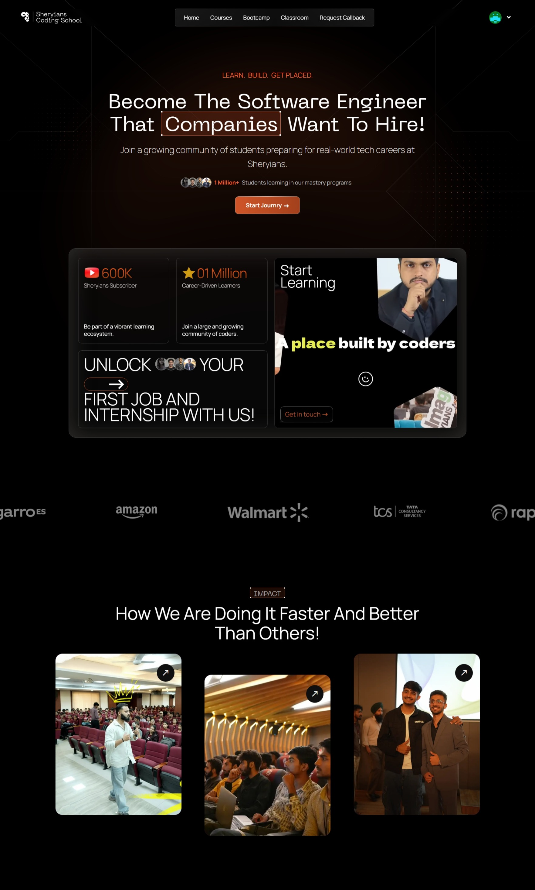

# Sheryians Clone

A simple frontend clone inspired by the Sheryians landing page, built with plain HTML and CSS.

## Preview



## Features

- Responsive landing page structure
- Custom typography with local font files
- Animated navigation hover effect
- Hero section with video background card
- Scrolling company marquee
- Interactive impact cards with hover states

## Project Structure

```text
sheryains-clone/
├── index.html
├── style.css
├── clone.jpeg
└── Assets/
```

## Tech Used

- HTML5
- CSS3
- Remix Icon

## How to Run

1. Open the project folder.
2. Run `index.html` in your browser.

## Assets

This project uses:

- Local fonts from the `Assets` folder
- A local preview image: `clone.jpeg`
- External image and media links for UI content

## Note

This project is made for practice and learning purposes only. All original branding and media belong to their respective owners.
